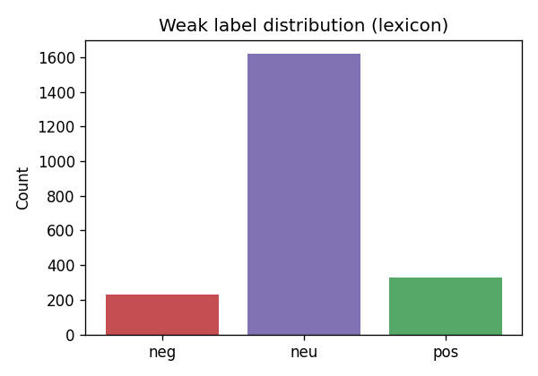
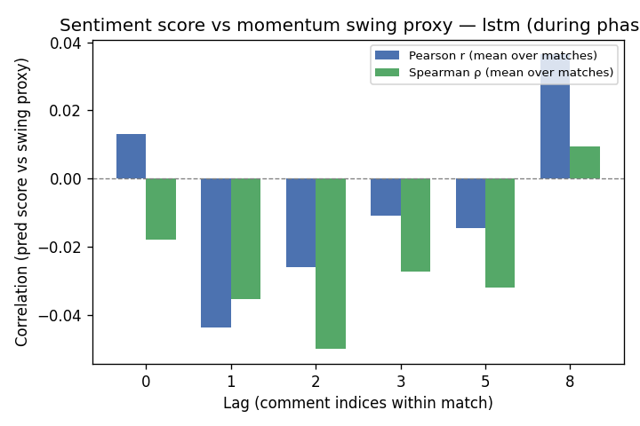

# Evaluating temporal sentiment as a signal for momentum-like scoreline swings in CS2 match threads

**Course:** DS680 — NLP final project  
**Author:** Christian Laggui  

## Abstract

We ask whether **time-binned sentiment velocity** from audience comments aligns with **heuristic scoreline swing markers** in a **self-built** SQLite corpus of HLTV-style Counter-Strike 2 match threads (timestamped lines with embedded score contexts). We compare **Multinomial Naive Bayes** (unigram and bigram) to **embedding + LSTM** classifiers that score each comment from its token sequence, then map predicted probabilities to a scalar score and compute velocity over fixed-width bins. Training and evaluation use **match-level splits** and both **weak lexicon labels** and a **hand-labeled gold subset**. A second LSTM configuration (**hidden size 64** vs **128**) satisfies the course expectation for hyperparameter/architecture exploration. On 2,174 comments over 16 matches, the larger LSTM achieves the best **macro-F1** on held-out fixtures under weak supervision, but **gold** evaluation remains difficult for the minority negative class. **Aggregate** correlations between per-comment scores and our swing proxy are **near zero**; we treat that as the primary empirical finding rather than evidence of reliable momentum prediction.

## 1. Introduction

Live match threads are short, slang-heavy, and only loosely tied to latent game state. We do **not** claim to recover full momentum from text alone; we **evaluate** a simple two-stage pipeline—(i) sentiment classifiers, (ii) temporal aggregation and correlation against a transparent proxy derived from `score_context` strings—and report where it succeeds and fails.

## 2. Related work

**[1] Moon et al. (EMNLP 2023)** study **norm violations in Twitch live chat**, show that models trained on forum-style data degrade, and improve moderation with **human-identified contextual features** [1]. *Limitation:* task is violation detection, not continuous polarity derivatives; data are English Twitch, not CS2 forums. *Gap:* we target **score-linked sentiment dynamics**, not moderation labels.

**[2] Gao et al. (ACL 2023)** introduce **LiveChat**, a large **Chinese** live-streaming dialogue benchmark emphasizing addressee and response modeling [2]. *Limitation:* language and task differ from ours; models are evaluated on dialogue generation/retrieval, not scoreline-linked velocity. *Gap:* our corpus is smaller, English, and **paired with partial scorelines** per comment.

**[3] Wu et al. (EMNLP 2023)** propose **SentiStream**, co-training for **sentiment in evolving streams** [3]. *Limitation:* streams are generic social feeds, not esports; method assumes ongoing label adaptation rather than a fixed match window. *Gap:* we use **static weak + gold labels** and explicit **in-match** time bins rather than open-ended stream drift.

**[4] Chen et al. (EMNLP 2024)** present **D2R**, a **multimodal** routing network for sentiment detection [4]. *Limitation:* requires aligned non-text modalities; our setting is **text-only**. *Gap:* highlights that **fusion and routing** matter for affect; we isolate **lexical temporal** signal only.

**[5] Shukla et al. (ACL 2025)** audit **Twitch AutoMod**, finding high bypass and false-positive rates, underscoring **context sensitivity** of platform classifiers [5]. *Limitation:* hate-speech audit, not sentiment velocity. *Gap:* motivates caution when repurposing moderation-style features for analytics on similar chat.

## 3. Methodology

**Corpus.** We assembled comments in `data/hltv_sentiment.db` from **publicly accessible** HLTV-style sources using the project collector; this is **not** a standard packaged NLP dataset. Ingest respects site **terms** and **robots.txt** (automated forum fetch off by default); see `docs/HLTV_SENTIMENT_COLLECTION.md` for compliance, import/JSONL options, and what we redistribute (code, metrics, aggregates—**not** necessarily raw text dumps).

**Labels and splits.** Weak labels use `nlp.preprocess` + `nlp.weak_labels`; gold integers in {0,1,2} can be merged from CSV. Splits are **`by_match`** with 15% validation and 15% test so rows from one `match_id` do not cross partitions. Optional **pre/during/post** phases use `nlp.time_windows`; momentum analysis uses **during** comments.

**Models.** **NB:** `CountVectorizer` + `MultinomialNB` (`scripts/train_sentiment_nb.py`). **LSTM:** `CommentLSTM` embeds **word tokens within each comment** (max length 64), mean-pools LSTM outputs, and classifies; it does **not** encode the full ordered list of comments as one sequence—**cross-comment time** enters only when we bin scores (`nlp.velocity.velocity_per_bin`). **Swing proxy:** `swing_labels_from_context` on parsed round differentials in `score_context`; **lags** are comment-index offsets (`scripts/eval_sentiment_momentum.py`).

**Reproduction.** Full command sequence and PDF build: [`nlp/ProjectDocs/REPRO_COMMANDS.md`](REPRO_COMMANDS.md).

## 4. Experiments

We train weak-supervised baselines with seed **42**, evaluate on the held-out **match split** (`sentiment_models/**/_metrics.json` and `sentiment_eval/metrics_*.json`), and run momentum JSON export for the **default (hidden 128) LSTM** and NB (qualitative pattern matches the smaller LSTM).

## 5. Results

### 5.1 Dataset snapshot

From `dataset_stats.json`: **2,174** comments, **16** matches, **530** gold-labeled rows; weak counts neg/neu/pos **228 / 1,618 / 328**; timestamps and score contexts **100%** populated in this build.

Additional histograms (comments per match, phase counts) remain in `nlp/ProjectDocs/figures/` for inspection.

### 5.2 Classification (weak labels, test split, n=390)

| Model | Macro-F1 | neg F1 | neu F1 | pos F1 |
|-------|-----------|--------|--------|--------|
| NB unigram | 0.606 | 0.40 | 0.89 | 0.53 |
| NB bigram | 0.596 | 0.33 | 0.89 | 0.57 |
| LSTM, hidden 128 | **0.658** | 0.45 | 0.91 | 0.62 |
| LSTM, hidden 64 | 0.640 | 0.40 | 0.90 | 0.62 |

**Bigram NB** underperforms unigram on **macro-F1** despite slightly higher positive F1: with **short messages** and a **match-aware** split, many bigrams are **sparse** or appear only in one fixture, so the vectorizer sees **fragmented statistics** relative to unigrams; the model can also **overfit** bigram patterns on the training matches without transferring.

**LSTM variants:** reducing hidden size from 128 to 64 **lowers macro-F1** on weak labels. On **gold** labels (n=101 test rows with human annotations), the default LSTM retains macro-F1 **0.61** vs **0.49** for the 64-unit model—the smaller net shows **zero precision/recall on negative** in this split, illustrating **variance** under class imbalance.

### 5.3 Momentum proxy

With **during**-phase filtering, **five** matches contribute to aggregate momentum statistics. Mean lag correlations (Pearson / Spearman) stay **close to zero** across lag offsets (see `momentum_report_lstm.json`); we interpret this as **weak linear coupling** between chat polarity scores and our coarse proxy—not as proof of absence of all structure (see exemplar plots in `figures/`).

## 6. Discussion

Weak-label evaluation **overstates** agreement with the lexicon; **gold** metrics are the better deployment proxy. The swing label is a **heuristic** on partial score strings, not a full demo tick stream. For **stronger** match-level modeling, a hierarchical encoder over comment sequences would be more faithful than per-comment LSTMs plus post-hoc binning.

## 7. Conclusion

We documented an honest end-to-end pipeline: match-aware sentiment baselines, an extra LSTM width ablation, and velocity-based analysis against a scoreline proxy. The headline result is **cautious**: **macro-F1** gains from the larger LSTM are real on weak labels, but **gold** performance and **momentum correlations** show that **forum text alone is a weak stand-in for momentum** at our scale.

## References

[1] J. Moon *et al.*, “Analyzing Norm Violations in Live-Stream Chat,” EMNLP, 2023. https://aclanthology.org/2023.emnlp-main.55/

[2] J. Gao *et al.*, “LiveChat: A Large-Scale Personalized Dialogue Dataset Automatically Constructed from Live Streaming,” ACL, 2023. https://aclanthology.org/2023.acl-long.858/

[3] Y. Wu *et al.*, “SentiStream: A Co-Training Framework for Adaptive Online Sentiment Analysis in Evolving Data Streams,” EMNLP, 2023. https://aclanthology.org/2023.emnlp-main.380/

[4] Y. Chen *et al.*, “D2R: Dual-Branch Dynamic Routing Network for Multimodal Sentiment Detection,” EMNLP, 2024. https://aclanthology.org/2024.emnlp-main.207/

[5] P. Shukla *et al.*, “Silencing Empowerment, Allowing Bigotry: Auditing the Moderation of Hate Speech on Twitch,” ACL, 2025. https://aclanthology.org/2025.acl-long.1110/

BibTeX: [`references.bib`](references.bib).
