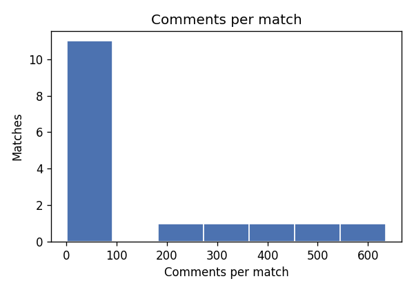
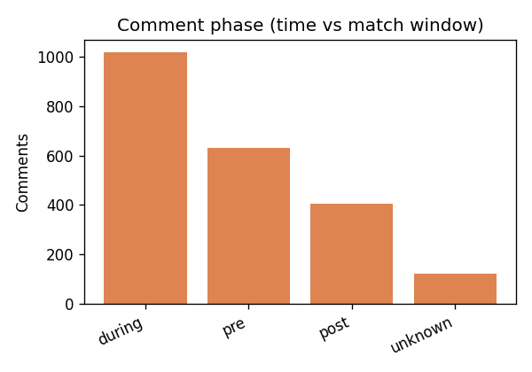

# Evaluating temporal sentiment as a signal for momentum-like scoreline swings in CS2 match threads

**Course:** DS680 — NLP final project  
**Author:** Christian Laggui  

## Abstract

I test whether **time-binned sentiment velocity** from audience comments lines up with **heuristic scoreline swing markers** in a **self-built** SQLite corpus of HLTV-style Counter-Strike 2 match threads (timestamped lines with embedded score contexts). I compare **Multinomial Naive Bayes** (unigram and bigram) to an **embedding + LSTM** classifier that scores each comment from its token sequence, then map predicted probabilities to a scalar score and compute velocity over fixed-width bins. Training and evaluation use **match-level splits**, weak lexicon labels, and a **hand-labeled gold subset**. I also train a second LSTM with **hidden size 64** instead of **128** to satisfy the course requirement for hyperparameter exploration. On 2,174 comments over 16 matches, the larger LSTM reaches the highest **macro-F1** on held-out matches under weak supervision. **Gold** labels still make the minority negative class hard. At the aggregate level, correlations between per-comment scores and my swing proxy stay **near zero**. That is the main quantitative result: I do not treat it as proof that chat is useless, only that this proxy and model stack do not show a strong linear link at the granularity I used.

## 1. Introduction

Match threads are short, slang-heavy, and only loosely tied to latent game state. I am not trying to recover full momentum from text alone. I **evaluate** a two-stage pipeline I built: (i) sentiment classifiers, (ii) temporal aggregation and correlation against a transparent proxy derived from `score_context` strings. I report where that pipeline helps and where it breaks.

## 2. Related work

Recent ACL and EMNLP work makes clear that **live-stream chat** is a bad fit for models trained on threaded forums. Moon et al. show that Twitch norm-violation detection gains roughly a third in accuracy once moderators’ contextual cues are folded in [1], which matches my intuition that raw bag-of-words scores will miss a lot on match threads. Shukla et al.’s audit of Twitch AutoMod [5] reinforces how brittle keyword-style moderation can be—useful background when I reuse off-the-shelf sentiment machinery on similar slang. Gao et al.’s **LiveChat** corpus [2] pushes in a different direction: large-scale **Chinese** live-stream dialogue with addressee modeling. I borrow their motivation that generic social data does not transfer blindly, even though my English CS2 slice is much smaller and tied to scorelines per row.

A second cluster of papers covers **sentiment under drift or multimodal context**. Wu et al.’s **SentiStream** [3] targets sentiment in evolving streams with co-training; I stay with a fixed match window and static weak labels, so their streaming adaptation is adjacent rather than directly applicable. Chen et al.’s **D2R** [4] routes multimodal signals for sentiment detection; I stay **text-only** on purpose, to see how far language alone carries before I add audio or vision. Together, these lines of work frame my choice: a lightweight text stack on noisy esports chat, with an explicit downstream correlation check rather than a leaderboard chase.

## 3. Methodology

**Corpus.** I assembled comments in `data/hltv_sentiment.db` from publicly accessible HLTV-style sources with the project collector. This is **not** a packaged Kaggle-style dataset. Ingest follows site **terms** and **robots.txt** (forum crawling off by default); details sit in `docs/HLTV_SENTIMENT_COLLECTION.md`.

**Noise in the text.** Thread language mixes cheer, trash talk, and game jargon in a few tokens. Lines in the same schema as my stored `raw_text` include *“terrible throw holy moly”* and *“choke city unbelievable”* (from the multimatch regression sample shipped with this repo). A weak lexicon can tag those as negative quickly; irony or clipped praise (*“nice try wp boys”* after a loss) is harder, and copypasta-style fragments do not always match dictionary entries. That mismatch shows up later in gold versus weak disagreement.

**Labels and splits.** I normalize with `nlp.preprocess` and weak-label with `nlp.weak_labels`; gold labels in {0,1,2} can be merged from CSV. Splits are **`by_match`** with 15% validation and 15% test so one `match_id` never straddles partitions. For momentum I keep **during**-match comments using `nlp.time_windows`.

**NB baseline.** `CountVectorizer` plus `MultinomialNB` via `scripts/train_sentiment_nb.py`.

**LSTM.** I use `CommentLSTM` in `nlp/models_lstm.py`: embedding dimension **128**, single-layer LSTM with hidden **128** (ablation: **64**), **dropout 0.2** after embeddings, mean pool over non-padding positions, then a linear head to three classes. I cap each comment at **64** tokens because most lines are short; longer rants are rare in this corpus. I train with **Adam**, learning rate **1e-3**, batch size **32**, up to **15** epochs with early stopping (**patience 4**) on validation loss. Vocabulary size on the training split is **2,454** types after frequency filtering. The LSTM reads **tokens inside one comment**; it does **not** consume the whole ordered list of comments in a match. Cross-comment time enters only when I bin scores with `nlp.velocity.velocity_per_bin`. The swing proxy is `swing_labels_from_context` on parsed round differentials in `score_context`; lags in `eval_sentiment_momentum.py` are comment-index offsets inside each match.

**Reproduction.** Full commands and PDF build: [`nlp/ProjectDocs/REPRO_COMMANDS.md`](REPRO_COMMANDS.md).

## 4. Experiments

I train weak-supervised baselines with seed **42** and evaluate on the held-out **match split**. I write metrics as JSON next to checkpoints and under the evaluation output directory (filenames in **REPRO_COMMANDS.md**). I export momentum summaries for the **default (hidden 128) LSTM** and for NB; the lag pattern looks similar for the smaller LSTM.

## 5. Results

### 5.1 Dataset snapshot

From `dataset_stats.json`: **2,174** comments, **16** matches, **530** gold-labeled rows; weak counts neg/neu/pos **228 / 1,618 / 328**; timestamps and score contexts are complete in this build.


### 5.2 Classification (weak labels, test split, n=390)

I pull per-class numbers from `sklearn` classification reports on the held-out match split. For NB unigram and both LSTMs I read the weak-label eval JSON from `eval_sentiment.py`; for NB bigram I read the test split report saved with the bigram training job (same protocol as unigram).

**Macro-F1 and negative class (minority, hardest).**

| Model | Macro-F1 | Neg P | Neg R | Neg F1 |
|-------|----------|-------|-------|--------|
| NB unigram | 0.606 | 0.55 | 0.32 | 0.40 |
| NB bigram | 0.596 | 0.80 | 0.21 | 0.33 |
| LSTM, hidden 128 | **0.658** | 0.48 | 0.42 | 0.45 |
| LSTM, hidden 64 | 0.640 | 0.83 | 0.26 | 0.40 |

**Neutral and positive classes.**

| Model | Neu P | Neu R | Neu F1 | Pos P | Pos R | Pos F1 |
|-------|-------|-------|--------|-------|-------|--------|
| NB unigram | 0.85 | 0.94 | 0.89 | 0.61 | 0.46 | 0.53 |
| NB bigram | 0.82 | 0.97 | 0.89 | 0.73 | 0.46 | 0.57 |
| LSTM, hidden 128 | 0.89 | 0.92 | 0.91 | 0.64 | 0.60 | 0.62 |
| LSTM, hidden 64 | 0.86 | 0.94 | 0.90 | 0.62 | 0.62 | 0.62 |

The negative class stays the bottleneck. Low **recall** on neg for both NB setups and for the 64-unit LSTM on weak labels means I am **missing** many negative comments, not just mis-scoring them at random. The 64-unit LSTM pushes **high precision but tiny recall** on neg under weak labels; on **gold** (n=101 in the test slice) it collapses to **zero** neg precision and recall in my run, while the 128-unit model still moves some mass into that cell (macro-F1 **0.61** vs **0.49**). My read is that sarcasm, clipped memes, and domain verbs (*throw*, *choke*, *eco*) interact badly with a tiny negative set: the model plays it safe and predicts neutral unless the surface form is blatant.

**Bigram NB** loses macro-F1 versus unigram even though positive F1 ticks up. Short lines plus a **match-aware** split starve many bigrams; the vectorizer sees fragmented counts and the model can memorize train-match n-grams that do not repeat on held-out fixtures.

### 5.3 Momentum proxy

Figure: mean lag correlation (Pearson / Spearman) between per-comment sentiment scores and the swing proxy, aggregated across matches (**default LSTM**, `during` phase).

{width=72%}

With **during**-phase filtering, **five** matches feed the aggregate momentum statistics. Mean lag correlations stay **close to zero** across offsets I tried (full tables in `momentum_report_lstm.json`). The near-zero aggregate pattern reads to me as **decoupling** between chat polarity and this coarse score proxy at the binning and lag grid I used—not a claim that no relationship exists at finer granularity.

## 6. Discussion

Weak-label scores inflate agreement with the lexicon; **gold** rows are the sanity check I trust more. The swing label is only as good as parsed `score_context` strings; it is not a tick-level demo. If I continue this line of work, a hierarchical encoder over ordered comments would match the scientific target more closely than my per-comment LSTM plus post-hoc binning.

## 7. Conclusion

I built an end-to-end pipeline: match-aware NB and LSTM baselines, a width ablation on the LSTM, and velocity-based checks against a scoreline heuristic. The classification head shows a clear lift for the larger LSTM on weak labels. The correlation head does not: **forum text, scored this way, does not line up strongly with my swing proxy** at the scale I have. I treat that as a **null result at this granularity**, not a verdict on all possible features or models.

## Appendix: supplemental figures

**Appendix A — Comments per match.** Distribution of how many comments appear per `match_id` in this build (helps explain variance in per-match momentum estimates).

{width=75%}

**Appendix B — Comment phase.** Counts of rows classified as pre-match, in-match, post-match, or unknown from timestamp windows.

{width=75%}

```{=latex}
\FloatBarrier
```
## References

[1] J. Moon *et al.*, “Analyzing Norm Violations in Live-Stream Chat,” EMNLP, 2023. https://aclanthology.org/2023.emnlp-main.55/

[2] J. Gao *et al.*, “LiveChat: A Large-Scale Personalized Dialogue Dataset Automatically Constructed from Live Streaming,” ACL, 2023. https://aclanthology.org/2023.acl-long.858/

[3] Y. Wu *et al.*, “SentiStream: A Co-Training Framework for Adaptive Online Sentiment Analysis in Evolving Data Streams,” EMNLP, 2023. https://aclanthology.org/2023.emnlp-main.380/

[4] Y. Chen *et al.*, “D2R: Dual-Branch Dynamic Routing Network for Multimodal Sentiment Detection,” EMNLP, 2024. https://aclanthology.org/2024.emnlp-main.207/

[5] P. Shukla *et al.*, “Silencing Empowerment, Allowing Bigotry: Auditing the Moderation of Hate Speech on Twitch,” ACL, 2025. https://aclanthology.org/2025.acl-long.1110/

BibTeX: [`references.bib`](references.bib).
