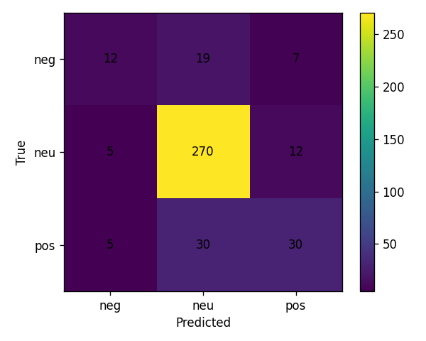
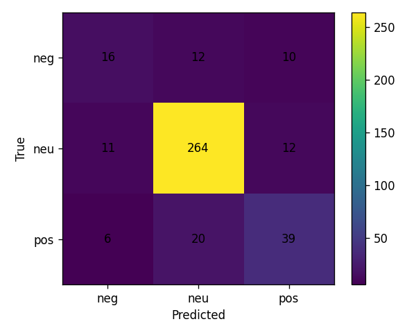
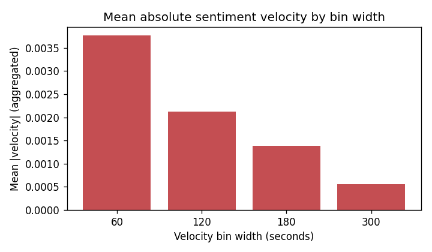
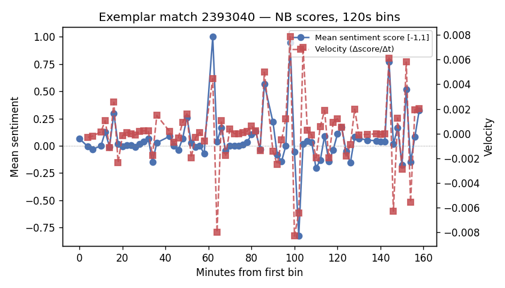

# Predicting Momentum Shifts from Temporal Sentiment in Competitive Esports Match Threads

**Course:** DS680 — NLP final project  
**Author:** Christian Laggui  
**Repository:** Steam API / HLTV sentiment pipeline (`nlp/`, `collector/`, `scripts/`)

## Abstract

Live audience text around professional Counter-Strike 2 (CS2) matches is noisy, informal, and tightly coupled to scoreboard state. We study whether **sentiment velocity**—the rate of change of an aggregate polarity score over time—tracks **momentum-like swings** in the match, using timestamped comments stored alongside per-comment scorelines in a local SQLite corpus derived from HLTV-style match threads. We compare a **Multinomial Naive Bayes** bag-of-words baseline to an **embedding + LSTM** classifier that scores each comment in isolation (word-order within the comment), then aggregate predicted probabilities into a scalar score and compute velocity in fixed time bins. Evaluation uses **match-level splits** to reduce leakage across the same fixture, weak lexicon labels with a **hand-labeled gold subset**, and a transparent **round-differential swing proxy** for momentum analysis. On our current corpus (2,174 comments across 16 matches), the LSTM slightly improves macro-F1 over unigram NB on the held-out match split under weak supervision, while gold-label evaluation shows both models remain brittle on the minority negative class. Aggregate lag correlations between per-comment scores and the swing proxy are near zero at the corpus scale, highlighting the difficulty of inferring macro game state from chat alone—an honest result we position as the main scientific takeaway.

## 1. Introduction

Sentiment analysis is often benchmarked on static reviews. Esports match threads are different: messages arrive in bursts, vocabulary is domain-specific, irony and copypasta are common, and the latent “momentum” we care about is a **team-level** construct inferred from partial observables (kills, economy, clutches) that viewers react to. We ask a narrower, operational question: **does the *derivative* of crowd polarity with respect to time align with heuristic markers of scoreline volatility** derived from the embedded score context on each comment?

We contribute: (1) a reproducible **two-stage pipeline**—classifier → per-comment polarity score → **time-binned velocity** and lagged correlation against a swing proxy; (2) **empirical baselines** (NB vs LSTM) with match-aware splits; and (3) **dataset exploration and figures** grounded in the actual SQLite schema used in this repository.

## 2. Related work

Recent NLP work on live-stream text emphasizes how **non-threaded, ephemeral chat** breaks assumptions built on Reddit-style trees. Moon et al. (EMNLP 2023) study **norm violations on Twitch**, show that off-the-shelf models degrade on live-stream chat, and obtain large gains by injecting **human-identified contextual cues**—a reminder that naive bag-of-words models miss interaction patterns our HLTV threads also lack at the structural level [1]. Gao et al. (ACL 2023) introduce **LiveChat**, a large Chinese live-streaming dialogue resource targeting addressee and response modeling [2]; we borrow their motivation that **transfer from generic social corpora is unreliable** for fast-moving chat, though our setting is English CS2 discourse at much smaller scale.

Closer to **sentiment as a ranking signal**, Lai and Sato (SIGDIAL 2024) propose a **multi-criteria framework** for “response-worthy” live chats, explicitly including **sentiment polarity and intensity** alongside topicality [3]. That aligns with our use of a continuous score from class probabilities, but we apply it to **external game dynamics** rather than streamer reply selection. Hämäläinen et al. (NLP4DH 2024) cluster **Twitch chatter embeddings** from an LLM and recover recurring behavioral roles (supportive viewers, emoji-heavy participants) [4], illustrating **heterogeneity of intent** within the same channel—useful context when interpreting aggregate velocity on mixed audiences. Finally, Shukla et al. (ACL 2025) audit **Twitch AutoMod** and show brittle keyword reliance and high false positive rates on benign but sensitive language [5], underscoring **risk if moderation-grade classifiers were naively repurposed for sentiment analytics** on similar platforms.

**Gap for this project:** prior work either targets moderation/dialog tasks or macro user modeling; we combine **weakly supervised sentiment** with **hand-labeled validation** and an explicit **temporal derivative** linked to a **game-state proxy**, which is under-explored at ACL venues for forum-style CS2 data.

## 3. Methodology

### 3.1 Data and ethics

Comments and match rows live in `data/hltv_sentiment.db` (see `docs/HLTV_SENTIMENT_COLLECTION.md`). Ingest respects site terms and defaults to **not** crawling disallowed forum paths; JSONL import is supported for reproducible offline pipelines. Each comment stores `raw_text`, `posted_at_unix`, optional `score_context` (scoreline string), and optional `gold_label`.

### 3.2 Preprocessing and labels

We normalize text with `nlp.preprocess.clean_text` and derive **weak labels** from a lexicon (`nlp.weak_labels`). Gold labels (0/1/2 = negative/neutral/positive) can be merged via CSV (`scripts/import_gold_labels.py`). Training supports `weak`, `gold`, or `hybrid` label sources (`nlp.dataset.apply_label_source`).

### 3.3 Match phases

Using `match_start_unix` / `match_end_unix` when present, we assign `comment_phase` in {pre, during, post, unknown} (`nlp.time_windows`). Momentum analysis defaults to **during**-match comments to avoid conflating hype before/after the server with in-round dynamics.

### 3.4 Splits

We evaluate with **`by_match` train/val/test** fractions (15%/15% holdout) so that all rows from one `match_id` stay in a single split—stricter than i.i.d. shuffling and better aligned with deployment across unseen fixtures.

### 3.5 Models

- **NB baseline:** sklearn `CountVectorizer` (unigram default; we also train **bigram** as an additional experiment) + `MultinomialNB` (`scripts/train_sentiment_nb.py`).
- **LSTM:** `nlp.models_lstm.CommentLSTM` — embedding lookup, single-layer LSTM over **tokens of each comment** (max length 64), mean pooling over non-padding positions, linear head to three classes. **Important:** this is **not** a recurrent model over the ordered sequence of comments in a match; cross-comment temporal structure enters only in the **post hoc velocity** stage.

### 3.6 Sentiment velocity and swing proxy

Per comment we map predicted class probabilities to a score in [-1, 1] (`nlp.velocity.scores_from_probs`). For each match we sort by time and compute **binned mean scores** and their temporal differences (`velocity_per_bin`). Separately, we derive a binary **swing proxy** from consecutive parsed round differentials in `score_context` (`swing_labels_from_context`). `scripts/eval_sentiment_momentum.py` reports **Pearson and Spearman** correlations between per-comment scores and swing labels at several **forward lags** (comment index offsets within the match), plus mean absolute velocity across bin widths {60, 120, 180, 300} seconds.

## 4. Experiments

**Environment:** Python 3.x with `torch`, `sklearn`, `pandas`; commands below assume repository root.

**Reproducibility flags recorded:** `--seed 42`, `--split-mode by_match`, `--label-source weak` for primary training runs, default `data/hltv_sentiment.db`.

1. `python scripts/migrate_hltv_sentiment_db.py`  
2. `python scripts/train_sentiment_nb.py --split-mode by_match --ngram unigram --label-source weak`  
3. `python scripts/train_sentiment_nb.py --split-mode by_match --ngram bigram --label-source weak --save-dir sentiment_models/nb_bigram`  
4. `python scripts/train_sentiment_lstm.py --split-mode by_match --label-source weak --epochs 15 --patience 4`  
5. `python scripts/eval_sentiment.py --model-type nb --split-mode by_match --label-source weak` (and `--label-source gold`)  
6. `python scripts/eval_sentiment.py --model-type lstm --split-mode by_match --label-source weak` (and `gold`)  
7. `python scripts/eval_sentiment_momentum.py --model-type nb --checkpoint sentiment_models/nb/nb_unigram.joblib --phase during --out nlp/ProjectDocs/momentum_report_nb.json`  
8. `python scripts/eval_sentiment_momentum.py --model-type lstm --checkpoint sentiment_models/lstm/lstm_weak.pt --phase during --out nlp/ProjectDocs/momentum_report_lstm.json`  
9. `python scripts/report_hltv_dataset_stats.py`  
10. `python scripts/plot_momentum_report.py --input nlp/ProjectDocs/momentum_report_nb.json --out-dir nlp/ProjectDocs/figures/momentum_nb` (and LSTM path)  
11. `python scripts/plot_match_velocity_exemplar.py --model-type nb --out nlp/ProjectDocs/figures/exemplar_match_velocity_nb.png`

## 5. Results

### 5.1 Dataset summary

Statistics are frozen in `nlp/ProjectDocs/dataset_stats.json` (generated by `scripts/report_hltv_dataset_stats.py`). Snapshot for this submission build:

| Quantity | Value |
|----------|------:|
| Comments | 2,174 |
| Matches | 16 |
| Gold-labeled comments | 530 |
| Weak labels (neg / neu / pos) | 228 / 1,618 / 328 |
| Non-null timestamps | 100% |
| Non-empty score_context | 100% |

Exploration figures:

The class distribution is **strongly neutral-heavy**, so accuracy can look high while **macro-F1** remains the more informative headline metric.

### 5.2 Classification (held-out matches)

**Test split (weak labels, by_match):** Unigram NB achieves **macro-F1 0.606**; bigram NB **0.596**; LSTM **0.658** (from `sentiment_models/*/nb_*_metrics.json` and `lstm/lstm_metrics.json`). The LSTM improves recall on positive and neutral rows modestly relative to NB on this split.

**Gold labels on the same test rows (subset with human labels):** NB macro-F1 **0.49** (n=101); LSTM **0.61** (n=101) — `sentiment_eval/metrics_*_gold.json`. Gold evaluation is **closer to intended deployment** because it does not reward agreement with the noisy lexicon.

Confusion matrices (weak test split):

| NB (weak) | LSTM (weak) |
|-----------|-------------|
|  |  |

Both models struggle on **negative** sentiment (few examples and subtle negation).

### 5.3 Momentum and velocity

Per-match aggregation (`eval_sentiment_momentum.py`, **during** phase) yields **5 matches** with sufficient comments for the velocity pipeline in this build. Mean lag correlations (Pearson / Spearman) hover near **zero** with mixed sign across lags; see `nlp/ProjectDocs/momentum_report_lstm.json` for numeric tables. **Interpretation:** on this corpus, linear alignment between per-comment polarity scores and the coarse swing heuristic is **weak**, consistent with heavy noise and the proxy’s imperfection.

Figures (LSTM run):

**Exemplar match** (largest match in split by comment count, NB scores, 120s bins):

The exemplar plot shows **genuine temporal structure** in binned scores even when aggregate correlations vanish—suggesting case-study or match-typed analyses as future work.

## 6. Discussion

**Weak-label leakage:** evaluating against weak labels inflates agreement; we therefore report **gold** metrics where available.

**Proxy limitations:** `score_context` strings are not a full demo tick stream; swing detection uses a **fixed lookahead** on parsed differentials and is sensitive to parsing gaps.

**Modeling mismatch:** if the scientific target is strictly **sequence-of-comments dynamics**, a hierarchical encoder over the match timeline would be more faithful than our **comment-level LSTM + external binning**—at higher implementation and data cost.

## 7. Conclusion

We implemented and documented an end-to-end pipeline from SQLite ingest through NB/LSTM sentiment baselines to **velocity-based momentum analysis** with match-aware evaluation. The LSTM improves macro-F1 over unigram NB on held-out matches under weak supervision, but **gold-label** performance and **momentum correlations** show the problem remains hard: crowd text is a noisy lens on latent game state. The artifact bundle (`dataset_stats.json`, `metrics_*.json`, `momentum_report_*.json`, and figures under `nlp/ProjectDocs/figures/`) is suitable for replication on larger, consent-aligned corpora.

## References

[1] J. Moon *et al.*, “Analyzing Norm Violations in Live-Stream Chat,” EMNLP, 2023. https://aclanthology.org/2023.emnlp-main.55/

[2] J. Gao *et al.*, “LiveChat: A Large-Scale Personalized Dialogue Dataset Automatically Constructed from Live Streaming,” ACL, 2023. https://aclanthology.org/2023.acl-long.858/

[3] Z. Lai and K. Sato, “Multi-Criteria Evaluation Framework of Selecting Response-worthy Chats in Live Streaming,” SIGDIAL, 2024. https://aclanthology.org/2024.sigdial-1.16/

[4] M. Hämäläinen, J. Rueter, and K. Alnajjar, “Analyzing Pokémon and Mario Streamers’ Twitch Chat with LLM-based User Embeddings,” NLP4DH, 2024. https://aclanthology.org/2024.nlp4dh-1.48/

[5] P. Shukla *et al.*, “Silencing Empowerment, Allowing Bigotry: Auditing the Moderation of Hate Speech on Twitch,” ACL, 2025. https://aclanthology.org/2025.acl-long.1110/

BibTeX entries are collected in [`references.bib`](references.bib).

---

### Appendix: PDF export

If Pandoc is installed with a LaTeX engine, we can compile this report to PDF from the repository root, for example:

`pandoc nlp/ProjectDocs/FINAL_NLP_REPORT.md -o nlp/ProjectDocs/FINAL_NLP_REPORT.pdf --resource-path=nlp/ProjectDocs`

Figures use paths relative to this file (`figures/...`); keep `--resource-path=nlp/ProjectDocs` so images resolve.
